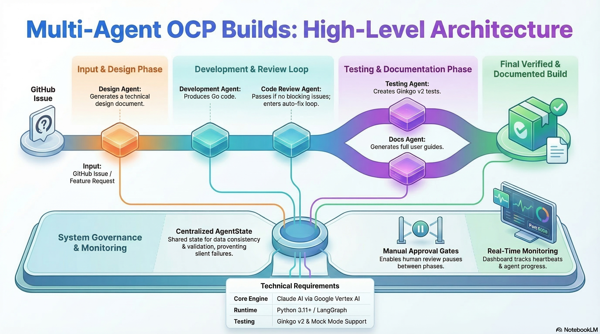

# Multi-Agent OCP Builds

AI-powered development orchestrator for Shipwright Build using Claude AI and LangGraph. This system automates the design, development, testing, and documentation workflow for OpenShift and Shipwright Build projects. You provide a feature request or bug report; the agent pipeline returns a design document, production Go code, Ginkgo v2 tests, and full documentation.



---

## Documentation

Full documentation is available in the **[User Guide](docs/user-guide/README.md)**.

| Section | Description |
|---------|-------------|
| [Getting Started](docs/user-guide/01-getting-started/installation.md) | Installation, quick start, configuration |
| [Core Concepts](docs/user-guide/02-concepts/architecture.md) | Architecture, agents, state management |
| [Agents](docs/user-guide/03-agents/design-agent.md) | Design, Development, Testing, Docs agents |
| [Dashboard](docs/user-guide/04-dashboard/overview.md) | Real-time monitoring |
| [Authentication](docs/user-guide/05-authentication/overview.md) | Vertex AI and API key setup |
| [Advanced](docs/user-guide/06-advanced/dry-run-mode.md) | Dry-run, logging, troubleshooting |
| [Examples](docs/user-guide/07-examples/README.md) | Working examples |
| [Testing](docs/user-guide/08-testing/README.md) | Test suite guide |

---

## Quick Start

See [Getting Started](docs/user-guide/01-getting-started/installation.md) for full setup instructions.

### Install

```bash
git clone https://github.com/yourusername/muilti-agents-ocp-builds.git
cd muilti-agents-ocp-builds
uv venv && uv pip install -r requirements.txt
cp .env.example .env
# Set ANTHROPIC_VERTEX_PROJECT_ID in .env
gcloud auth application-default login
```

### Run the Orchestration Workflow

```bash
uv run python scripts/orchestrate.py \
  --title "Add timeout support to BuildRun" \
  --description "Users need ability to specify build timeout to prevent hanging builds"
```

### Start the Real-Time Monitoring Dashboard

```bash
# Terminal 1 - Start dashboard (port 8080)
uv run python scripts/run_dashboard.py

# Terminal 2 - Run workflow
uv run python scripts/orchestrate.py --title "Feature title" --description "Description"
```

### Run Tests

```bash
# All tests (no credentials needed - uses mock mode)
uv run pytest tests/ -v

# With coverage
uv run pytest tests/ --cov=agents --cov=graph --cov-report=html
```

### Run with Manual Approval

```bash
# Run with manual approval (pause between phases to review)
MANUAL_APPROVAL=true uv run python scripts/orchestrate.py \
  --title "Add timeout support to BuildRun API" \
  --description "Users need to specify timeouts for build execution"
```

### Dry Run (No API Credentials Needed)

```bash
uv run python scripts/test_agents.py --e2e --dry-run --debug
```

> For more detail on any of these commands, see the [User Guide](docs/user-guide/README.md).

---

## Architecture

The system runs five Claude AI agents in a sequential LangGraph pipeline:

```
Issue → Design Agent → Development Agent → Code Review Agent → Testing Agent → Docs Agent → Done
                              ↑                    │ (fail: blocking issues found)
                              └────────────────────┘ auto-fix loop (≤ MAX_REVIEW_ITER)
```

Each agent reads from the shared `AgentState` and writes its outputs back before the next agent begins. Each phase includes automatic output validation — the workflow stops immediately if required outputs are missing, rather than silently passing bad data forward. See [Architecture](docs/user-guide/02-concepts/architecture.md) for a full breakdown.

---

## Requirements

| Requirement | Version |
|-------------|---------|
| Python | 3.11 or higher |
| Authentication | Google Vertex AI (Application Default Credentials) |
| Dashboard port | 8080 (local only) |
| Dry run | Yes - no credentials needed |

---

## Environment Variables

| Variable | Purpose |
|----------|---------|
| `ANTHROPIC_VERTEX_PROJECT_ID` | GCP project ID for Vertex AI auth (required) |
| `CLOUD_ML_REGION` | GCP region (default: `us-east5`) |
| `CLAUDE_MODEL` | Model override (default: `claude-sonnet-4-6`) |
| `DASHBOARD_ENABLED` | Enable heartbeats to dashboard (default: `true`) |
| `SHIPWRIGHT_REPO_PATH` | Path to Shipwright Build repo for deeper analysis |
| `MANUAL_APPROVAL` | Pause for user approval between phases (default: `false`) |

See [Configuration](docs/user-guide/01-getting-started/configuration.md) for the full reference.
