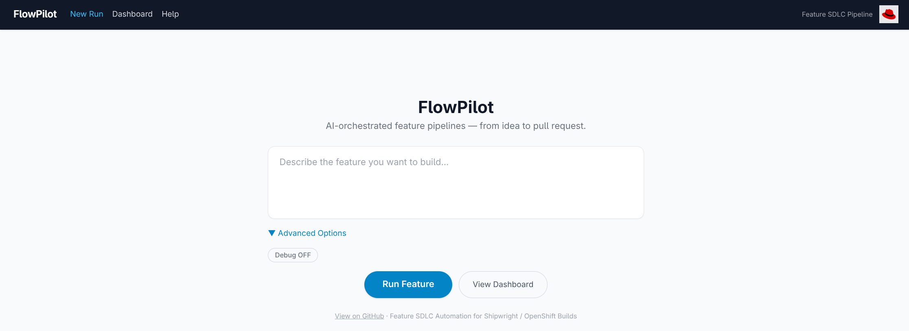
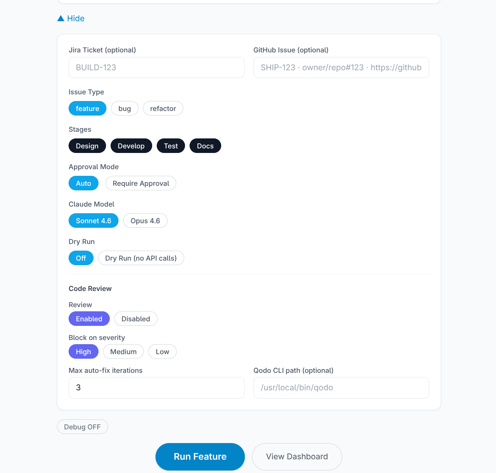
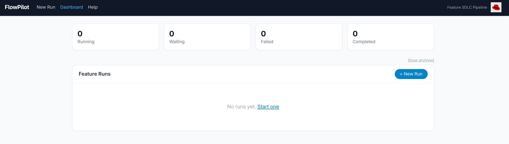
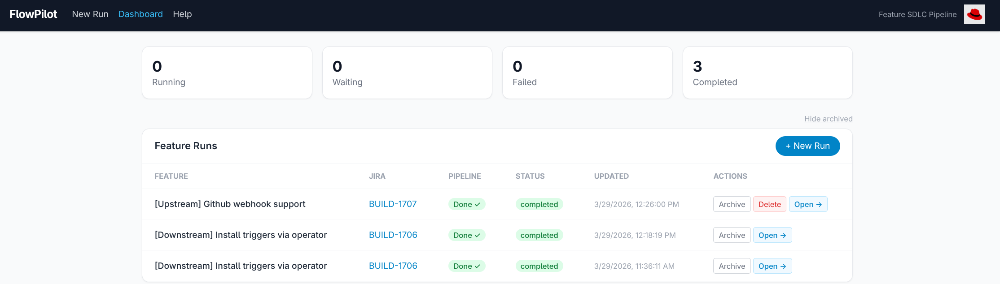
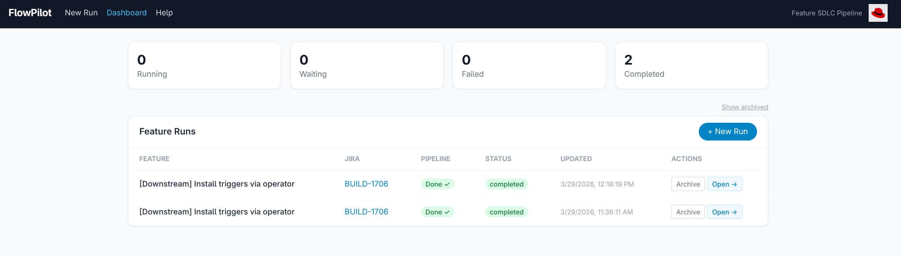

# Dashboard Overview

The FlowPilot dashboard is the recommended way to create and manage pipeline runs. It is a React single-page application that provides real-time visibility into each phase of the workflow, lets you approve or reject gated phases, download artifacts, stream logs, and manage completed runs. While a CLI is available for scripting and automation, the web UI offers the richest experience for day-to-day use.

---

## Architecture

```text
+-------------------------------------------------------------+
|                     Agent Workflows                          |
|  +--------------+   +--------------+   +--------------+     |
|  | Design Agent |-->| Dev Agent    |-->| Review Agent |     |
|  +--------------+   +--------------+   +--------------+     |
|                                              |               |
|  +--------------+   +--------------+         v               |
|  | Docs Agent   |<--| Testing Agent|<--------+              |
|  +--------------+   +--------------+                        |
|         | Heartbeat        | Heartbeat        | Heartbeat    |
|         v                  v                  v              |
|       (All 5 agents emit heartbeats to the backend)         |
+---------+------------------+------------------+--------------+
|                  Enricher Pipeline                           |
|  ModelInfo > TokenCount > PhaseStatus > Components > Risks   |
|  > IssueInfo > JiraInfo > Timestamp                          |
|                         |                                    |
|                         v                                    |
+-------------------------------------------------------------+
|                  Dashboard Backend                           |
|              FastAPI + SQLite (dashboard/backend.py)         |
|    POST /api/heartbeat     GET /api/sessions                 |
|    POST /api/runs          GET /api/sessions/{id}/logs (SSE) |
|                         |                                    |
|                         v                                    |
+-------------------------------------------------------------+
|                    Web Frontend                              |
|        React 18 + Vite + Tailwind CSS (3-second polling)     |
|    New Run | Dashboard | Run Details | Risk Report Modal     |
+-------------------------------------------------------------+
```

### Technology Stack

- **Frontend:** React 18 + Vite + Tailwind CSS, polling every 3 seconds
- **Backend:** FastAPI + SQLite + Uvicorn
- **Integration:** Agents emit heartbeats via HTTP POST to `/api/heartbeat`
- **Storage:** SQLite at `DASHBOARD_DB_PATH` (default: `/tmp/claude/dashboard.db`)

---

## Starting the Dashboard

```bash
uv run python scripts/run_dashboard.py
```

The backend serves both the API and the built React frontend from `dashboard/frontend/dist/`.

| Endpoint | URL |
| --- | --- |
| Web UI | `http://localhost:8080` |
| API documentation | `http://localhost:8080/docs` |
| Health check | `http://localhost:8080/api/health` |

If the React build is not present, the server falls back to the legacy `index.html` or displays a message asking you to run `cd dashboard/frontend && npm run build`.

---

## Pages

The UI has three pages, all wrapped in a shared layout with a top navigation bar (FlowPilot logo, New Run link, Dashboard link, Help link to GitHub docs) and a Red Hat logo.

### New Run (`/`)

The landing page. Use it to launch a new pipeline run.



**Layout:** A centered form with the FlowPilot title and tagline "AI-orchestrated feature pipelines -- from idea to pull request."

**Fields:**

- **Feature description** (textarea, required unless a Jira ticket is provided) -- describe the feature to build.
- **Advanced Options** (collapsible panel, collapsed by default):

| Option | Description | Default |
| --- | --- | --- |
| Jira Ticket | Optional ticket ID, e.g. `BUILD-123` | empty |
| GitHub Issue | Optional, e.g. `SHIP-123`, `owner/repo#123`, or a full URL | empty |
| Issue Type | Toggle: `feature` / `bug` / `refactor` | `feature` |
| Stages | Multi-select: Design, Develop, Test, Docs. Code review is configured separately in the Code Review section below. | all selected |
| Approval Mode | `Auto` or `Require Approval` | Auto |
| Claude Model | `Sonnet 4.6` or `Opus 4.6` | Sonnet 4.6 |
| Dry Run | `Off` or `Dry Run (no API calls)` | Off |

  Code Review settings (nested inside Advanced Options):

| Option | Description | Default |
| --- | --- | --- |
| Review | `Enabled` or `Disabled` | Enabled |
| Block on severity | `High` / `Medium` / `Low` | High |
| Max auto-fix iterations | 1--10 | 3 |
| Qodo CLI path | Optional filesystem path | empty |



- **Debug toggle** (always visible) -- enables verbose logging.

**Actions:**

- **Run Feature** (primary button) -- submits the form, launches the run, and navigates to the Run Details page.
- **View Dashboard** -- navigates to `/runs`.

**Footer:** A "View on GitHub" link and project tagline.

---

### Dashboard (`/runs`)

The runs list page. Shows all pipeline runs at a glance.



**Status summary cards** (top row, clickable to filter):

```text
+------------+  +------------+  +------------+  +--------------+
|  Running   |  |  Waiting   |  |   Failed   |  |  Completed   |
|     3      |  |     1      |  |     0      |  |      7       |
+------------+  +------------+  +------------+  +--------------+
```

Click a card to filter the table to that status. Click again to clear the filter.

**Controls:**

- **Show archived / Hide archived** -- toggle link to include or exclude archived runs.



- **+ New Run** -- button inside the table header, navigates to `/`.

**Feature Runs table:**

| Column | Content |
| --- | --- |
| FEATURE | Issue title (or session ID if no title) |
| JIRA | Linked ticket ID, clickable to the Jira URL |
| PIPELINE | Phase chip showing latest phase (Starting, Design ✓, Dev ✓, Review ✓, Tests ✓, Done ✓, Error) |
| STATUS | Colored badge: `running` (blue), `waiting` (yellow), `failed` (red), `completed` (green) |
| UPDATED | Timestamp of last update |
| ACTIONS | Context-sensitive buttons (see below) |

**Action buttons per row:**

| Run status | Available actions |
| --- | --- |
| `waiting` | Approve, Open |
| `running` | Pause, Open |
| `completed` / `failed` | Archive, Open |
| `archived` | Delete (red, with confirmation dialog), Open |

All rows are clickable and navigate to the Run Details page.

**Empty state:** "No runs yet. Start one" with a link to `/`.



---

### Run Details (`/runs/:sessionId`)

The detail view for a single pipeline run.

**Header:**

- Back link to Dashboard
- Run title and session ID
- Status badge and Jira link (if available)
- Action buttons (context-sensitive):

| Run status | Available actions |
| --- | --- |
| `waiting` | Approve & Continue, Reject |
| `running` | Pause |
| `completed` / `failed` | Download All, Delete (with confirmation, navigates back to Dashboard) |

**Pipeline progress bar:**

A horizontal strip showing five phases connected by arrows. Each phase is color-coded:

- Green with checkmark -- completed
- Blue with pulse animation -- currently active
- Red -- failed (when the run ends in error)
- Gray -- pending

```text
[ Design ] --> [ Develop ] --> [ Review ] --> [ Test ] --> [ Docs ]
   done           done          active        pending      pending
```

**Tabs:**

1. **Summary** -- Code Files count, Test Files count, Risks Identified count (clickable to open the Risk Report modal), Design Analysis preview (first 2000 characters), PR Summary preview, and a Download Design button.

2. **Code** -- List of generated code files. Each file shows its path in a header bar and content in a scrollable code block. Download code.zip button at top.

3. **Tests** -- Test Plan (if available), then sections for Unit Tests, Integration Tests, and E2E Tests, each listing files with path and content. Download tests.zip button at top.

4. **Docs** -- PR Summary and Release Notes sections. Download docs.zip button at top.

5. **Logs** -- Real-time log stream via Server-Sent Events (SSE). Shows the log file path (`/tmp/claude/logs/{sessionId}.log`) with a Copy path button. Logs auto-scroll and display in a dark terminal-style pane.

**Risk Report Modal:**

Opens when you click the "Risks Identified" count on the Summary tab.

- Overall risk level badge (derived from highest severity across all risks)
- Sorted risk list (high first, then medium, then low)
- Each risk shows a severity badge, description, and mitigation (if provided)
- Closes on Escape key or clicking outside the modal

---

## Heartbeat Protocol

Each agent calls `emit_heartbeat(agent_name, state)` at the start and end of its phase. The `HeartbeatEmitter` in `dashboard/heartbeat.py` sends an HTTP POST to `/api/heartbeat`.

```python
# Called inside each agent node - example from graph.py
emit_heartbeat("design", {**state, "phase": "design_complete"})
```

If the dashboard is unreachable, heartbeats fail silently. The workflow is never blocked by dashboard availability.

### Enricher Pipeline

Raw heartbeat data passes through eight enrichers before storage:

| Enricher | Purpose |
| --- | --- |
| **ModelInfoEnricher** | Reads the Claude model name from the environment |
| **TokenCountEnricher** | Estimates context window usage percentage based on state size |
| **PhaseStatusEnricher** | Maps `current_phase` to a human-readable status label |
| **ComponentsEnricher** | Extracts impacted Shipwright components from state |
| **RisksEnricher** | Extracts risks and derives an overall risk level |
| **IssueInfoEnricher** | Extracts issue title, type, and description |
| **JiraInfoEnricher** | Extracts Jira ticket ID, URL, priority, and labels |
| **TimestampEnricher** | Adds formatted and relative timestamps |

---

## API Endpoints

### Core

| Method | Endpoint | Description |
| --- | --- | --- |
| GET | `/api/health` | Health check |
| POST | `/api/heartbeat` | Receive agent heartbeat |
| POST | `/api/runs` | Launch a new pipeline run |

### Sessions

| Method | Endpoint | Description |
| --- | --- | --- |
| GET | `/api/sessions` | List all sessions (`?include_archived=true` to include archived) |
| GET | `/api/sessions/{id}` | Get a specific session with all heartbeats |
| PATCH | `/api/sessions/{id}/archive` | Archive a session (hides from list, preserves data) |
| DELETE | `/api/sessions/{id}` | Permanently delete a session, heartbeats, and log file |
| DELETE | `/api/sessions/cleanup` | Delete completed sessions older than N hours (`?max_age_hours=24`) |
| DELETE | `/api/sessions/completed` | Delete all completed or errored sessions |
| DELETE | `/api/sessions/stuck` | Delete stale sessions with no heartbeat in N hours (`?max_stale_hours=6`) |

### Run Control

| Method | Endpoint | Description |
| --- | --- | --- |
| POST | `/api/sessions/{id}/approve` | Signal approval or rejection (`?action=approve` or `?action=reject`) |
| POST | `/api/sessions/{id}/pause` | Signal a running pipeline to pause after the current phase |

### Logs

| Method | Endpoint | Description |
| --- | --- | --- |
| GET | `/api/sessions/{id}/logs` | Stream pipeline logs via Server-Sent Events (SSE) |

### Artifact Downloads

| Method | Endpoint | Description |
| --- | --- | --- |
| GET | `/api/sessions/{id}/download/all` | Download all artifacts as a single zip |
| GET | `/api/sessions/{id}/download/design` | Download design analysis as Markdown |
| GET | `/api/sessions/{id}/download/code` | Download generated code files as a zip |
| GET | `/api/sessions/{id}/download/tests` | Download test files as a zip (unit, integration, e2e) |
| GET | `/api/sessions/{id}/download/docs` | Download documentation files as a zip |

---

## Database Schema

The dashboard stores data in two SQLite tables:

```sql
CREATE TABLE sessions (
    id TEXT PRIMARY KEY,
    created_at TIMESTAMP DEFAULT CURRENT_TIMESTAMP,
    updated_at TIMESTAMP DEFAULT CURRENT_TIMESTAMP,
    issue_title TEXT,
    issue_type TEXT,
    status TEXT DEFAULT 'active'
);

CREATE TABLE heartbeats (
    id INTEGER PRIMARY KEY AUTOINCREMENT,
    session_id TEXT NOT NULL,
    agent TEXT NOT NULL,
    phase TEXT,
    timestamp TIMESTAMP NOT NULL,
    model TEXT,
    context_tokens INTEGER,
    context_percent REAL,
    status TEXT,
    raw_state TEXT,
    enriched_data TEXT,
    FOREIGN KEY (session_id) REFERENCES sessions(id)
);

CREATE INDEX idx_session_timestamp
ON heartbeats(session_id, timestamp DESC);
```

A background task runs every 6 hours to clean up completed sessions older than 24 hours and stuck sessions (no heartbeat for 4+ hours in a non-terminal phase).

---

## Log Locations

Pipeline logs are written to `/tmp/claude/logs/{session-id}.log` by the orchestrate subprocess. The Logs tab in Run Details streams this file in real time.

Agent-level logs are written under the `logs/` directory when logging is configured:

```text
logs/
+-- agents/
|   +-- design_agent.log
|   +-- go_k8s_developer.log
|   +-- testing_agent.log
|   +-- docs_agent.log
+-- sessions/
    +-- {session-id}/
        +-- design_agent.log
        +-- development_agent.log
        +-- testing_agent.log
        +-- docs_agent.log
```

---

## Running with the Workflow

Start the dashboard, then use the web UI to create and monitor runs.

```bash
# Start the dashboard
uv run python scripts/run_dashboard.py
```

Open `http://localhost:8080` in your browser and use the **New Run** page to launch a pipeline run. Fill in the feature description (and optionally a Jira ticket or GitHub issue), choose your options, and click **Run Feature**. The backend spawns the orchestrate subprocess and the session appears in the Dashboard page within seconds.

### Alternative: CLI

For scripting and automation you can launch runs from the command line instead of the web UI.

```bash
# From a Jira ticket
uv run python scripts/orchestrate.py \
  --jira-ticket SHIP-123 \
  --output-dir ./output

# Or from a title and description
uv run python scripts/orchestrate.py \
  --title "Add timeout support to BuildRun" \
  --description "Users need ability to specify build timeout" \
  --output-dir ./output
```

CLI runs emit heartbeats to the dashboard like any other run, so you can still monitor progress in the web UI.

---

[← Previous: Docs Agent](../03-agents/docs-agent.md) | [Next: Session Management →](session-management.md)
